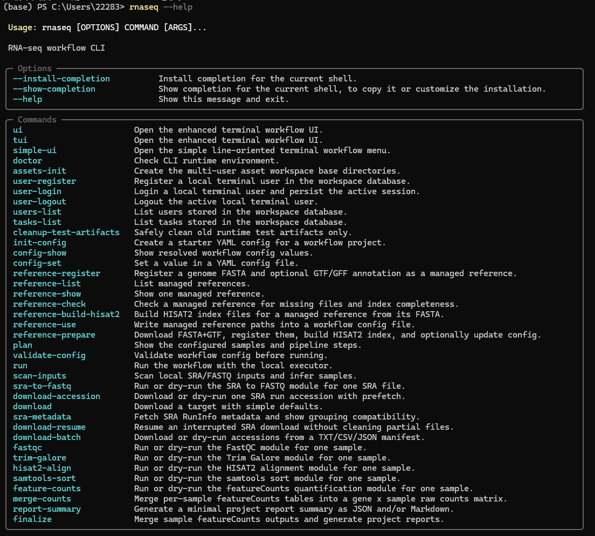
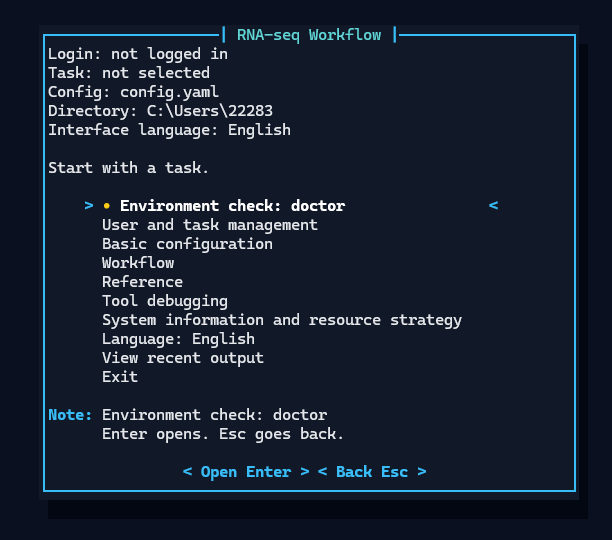
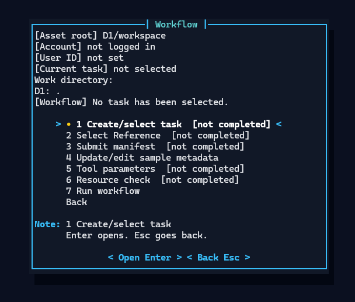

# RNA-seq Workflow

<p align="center">
  <a href="#english">English</a> |
  <a href="#简体中文">简体中文</a>
</p>

<a id="english"></a>

## English

RNA-seq Workflow is a modular command-line and terminal UI toolkit for reproducible RNA-seq analysis. It brings sample management, reference genome asset reuse, data download, quality control, trimming, alignment, quantification, and report generation into a single local workspace.

The project is designed for practical RNA-seq analysis, teaching, benchmarking, and manuscript-oriented experiments where users need both automation and an approachable terminal interface.

## Highlights

- Interactive TUI with bilingual English/Chinese text and concise guided prompts.
- User, task, and asset workspace management for reusable references, HISAT2 indexes, samples, and run records.
- Pre-alignment reference validation with species, assembly, provider, and annotation metadata to reduce FASTA/GTF mismatch risks.
- SRA/FASTQ input support with batch download, resume support, input scanning, and manifest generation.
- Upstream workflow modules for FastQC, Trim Galore, HISAT2, samtools, featureCounts, and StringTie.
- Sample-level parallel execution with configurable per-step thread counts.
- Expression matrix outputs including raw counts, CPM, TPM, and StringTie TPM. Raw counts are kept for count-based differential expression tools such as DESeq2 and edgeR, while TPM is recommended for expression visualization and workflow-consistency comparisons.
- Automatic `report.json`, `report.md`, count matrix, and expression matrix generation.

## Screenshots

CLI command overview:



Main TUI menu:



Workflow guide:



## Repository Layout

```text
workflow/rnaseq_workflow/   Python package and CLI/TUI implementation
modules/                    Module-level design notes
docker/                     Dockerfiles for bioinformatics tools
config/                     Example workflow config
requirements/               Python dependency list
test/                       Unit tests
templates/                  Download manifest templates
references/                 Managed reference metadata examples
workspace/                  Local runtime workspace, ignored by Git
```

## Installation

Python 3.10 or later is recommended.

```powershell
python -m venv .venv
.\.venv\Scripts\Activate.ps1
python -m pip install -U pip
python -m pip install -e .
```

After installation, the `rnaseq` command is available:

```powershell
rnaseq --help
```

## Build the Tool Image

The workflow runs external bioinformatics tools through Docker by default. After Docker Desktop is running, build the image that contains FastQC, Trim Galore, HISAT2, samtools, subread, and StringTie:

```powershell
docker build -f docker/Dockerfile.tools -t rnaseq-workflow:tools .
```

Check the runtime environment:

```powershell
rnaseq doctor
```

## Quick Start

Open the TUI:

```powershell
rnaseq tui
```

Create a starter config:

```powershell
rnaseq init-config config.yaml --overwrite
```

Edit `config.yaml` and replace the sample FASTQ/SRA, reference genome, GTF/GFF, and HISAT2 index paths with real files. Then validate the config:

```powershell
rnaseq validate-config config.yaml
```

Run a real workflow:

```powershell
rnaseq run config.yaml --no-dry-run --max-workers 2 --finalize
```

For manuscript-oriented TPM analysis, set expression outputs like this:

```yaml
expression_output_formats:
  - raw_counts
  - tpm
  - stringtie_tpm
```

## Reference Management

Register local reference files:

```powershell
rnaseq reference-register tair10 `
  --fasta references/tair10/genome.fa `
  --annotation references/tair10/annotation.gtf `
  --species "Arabidopsis thaliana" `
  --assembly TAIR10
```

Build the HISAT2 index:

```powershell
rnaseq reference-build-hisat2 tair10 --threads 8 --no-dry-run
```

List and check reference assets:

```powershell
rnaseq reference-list
rnaseq reference-check tair10
```

## Outputs

Typical outputs are written under the configured `output_dir`:

```text
output/
  samples/<sample_id>/
    qc_raw/
    trimmed/
    qc_trimmed/
    alignment/
    quantification/
  matrices/
    raw_counts.tsv
    tpm.tsv
    stringtie_tpm.tsv
  report.json
  report.md
```

Key files:

- `raw_counts.tsv` / `count_matrix.tsv`: featureCounts raw count matrix.
- `tpm.tsv`: TPM matrix derived from featureCounts Length values.
- `stringtie_tpm.tsv`: TPM matrix merged from StringTie gene abundance tables.
- `report.json` and `report.md`: run parameters, samples, step status, and summary reports.

## Development

Run all tests:

```powershell
pytest
```

Run selected tests:

```powershell
pytest test/cli
pytest test/alignment
```

<p align="right"><a href="#rna-seq-workflow">Back to top</a></p>

---

<a id="简体中文"></a>

## 简体中文

RNA-seq Workflow 是一个面向 RNA-seq 分析的模块化命令行与 TUI 工作流工具。项目将样本管理、参考基因组资产管理、下载、质控、修剪、比对、定量和报告生成整合到一个可复用的本地工作空间中，适合教学、论文实验、benchmark 和可重复分析场景。

## 主要功能

- TUI 图形化终端界面，支持中英文切换和简洁友好的引导提示。
- 用户、任务和资产工作空间管理，便于复用参考基因组、HISAT2 index、样本和运行记录。
- 比对前参考文件校验，记录物种、assembly、provider、annotation 等元数据，降低 FASTA/GTF 混用风险。
- 支持 SRA/FASTQ 输入、批量下载、断点续传、输入扫描和 manifest 生成。
- 上游流程覆盖 FastQC、Trim Galore、HISAT2、samtools、featureCounts、StringTie。
- 支持并行样本处理，并可配置单步线程数。
- 表达量输出支持 raw counts、CPM、TPM、StringTie TPM 等矩阵；raw counts 适合作为 DESeq2/edgeR 等差异分析输入，TPM 更适合表达量展示和流程一致性比较。
- 自动生成 `report.json`、`report.md`、count matrix 和表达矩阵，方便后续整理为论文图表。

## 界面截图

CLI 命令概览：


TUI 主菜单：


Workflow 向导：


## 项目结构

```text
workflow/rnaseq_workflow/   Python package and CLI/TUI implementation
modules/                    Module-level design notes
docker/                     Dockerfiles for bioinformatics tools
config/                     Example workflow config
requirements/               Python dependency list
test/                       Unit tests
templates/                  Download manifest templates
references/                 Managed reference metadata examples
workspace/                  Local runtime workspace, ignored by Git
```

## 安装

建议使用 Python 3.10 或更高版本。

```powershell
python -m venv .venv
.\.venv\Scripts\Activate.ps1
python -m pip install -U pip
python -m pip install -e .
```

安装后会提供 `rnaseq` 命令：

```powershell
rnaseq --help
```

## 构建工具镜像

工作流默认使用 Docker 执行外部生信工具。Docker Desktop 启动后，可构建包含 FastQC、Trim Galore、HISAT2、samtools、subread 和 StringTie 的镜像：

```powershell
docker build -f docker/Dockerfile.tools -t rnaseq-workflow:tools .
```

检查运行环境：

```powershell
rnaseq doctor
```

## 快速开始

启动 TUI：

```powershell
rnaseq tui
```

生成配置模板：

```powershell
rnaseq init-config config.yaml --overwrite
```

编辑 `config.yaml`，把样本 FASTQ/SRA、参考基因组、GTF/GFF 和 HISAT2 index 路径替换为真实文件后，再校验配置：

```powershell
rnaseq validate-config config.yaml
```

真实运行工作流：

```powershell
rnaseq run config.yaml --no-dry-run --max-workers 2 --finalize
```

常用输出格式可在配置中设置，例如期刊分析推荐：

```yaml
expression_output_formats:
  - raw_counts
  - tpm
  - stringtie_tpm
```

## 参考基因组管理

注册本地参考文件：

```powershell
rnaseq reference-register tair10 `
  --fasta references/tair10/genome.fa `
  --annotation references/tair10/annotation.gtf `
  --species "Arabidopsis thaliana" `
  --assembly TAIR10
```

构建 HISAT2 index：

```powershell
rnaseq reference-build-hisat2 tair10 --threads 8 --no-dry-run
```

查看和检查参考资产：

```powershell
rnaseq reference-list
rnaseq reference-check tair10
```

## 输出结果

典型输出位于配置中的 `output_dir`，按样本组织：

```text
output/
  samples/<sample_id>/
    qc_raw/
    trimmed/
    qc_trimmed/
    alignment/
    quantification/
  matrices/
    raw_counts.tsv
    tpm.tsv
    stringtie_tpm.tsv
  report.json
  report.md
```

其中：

- `raw_counts.tsv` / `count_matrix.tsv`：featureCounts 原始计数矩阵。
- `tpm.tsv`：基于 featureCounts Length 后处理得到的 TPM 矩阵。
- `stringtie_tpm.tsv`：从 StringTie gene abundance 表合并得到的 TPM 矩阵。
- `report.json` 和 `report.md`：运行参数、样本、步骤状态和报告摘要。

## 开发与测试

运行测试：

```powershell
pytest
```

只运行 CLI 或某个模块测试：

```powershell
pytest test/cli
pytest test/alignment
```

<p align="right"><a href="#rna-seq-workflow">回到顶部</a></p>
