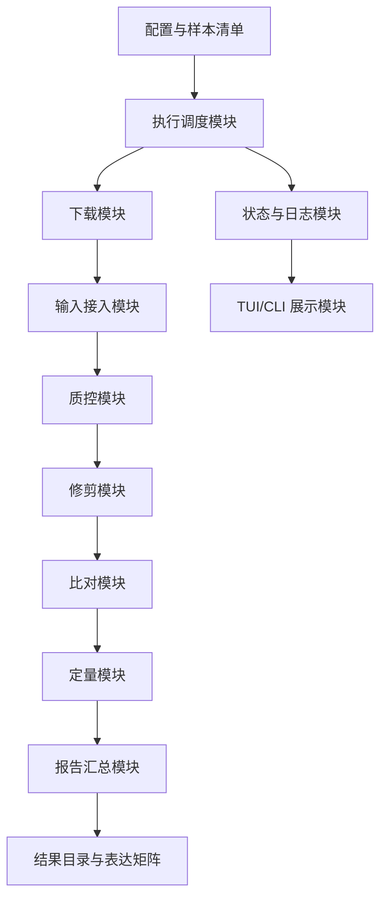

# RNA-seq 自动化流程模块化系统设计

## 1. 设计目标

本系统面向公共 RNA-seq 数据批量分析，目标是从老项目中提取核心业务目标，并重新开发一个模块化、可测试、可恢复、可审计的轻量化工作流。

`old_prj` 目录只作为只读参考材料使用，不在其上继续修 bug、迭代或直接迁移代码。新系统以 `workflow/rnaseq_workflow` 为核心代码位置，以 `modules` 和 `docs` 作为设计说明位置。

核心目标：

1. 支持从 SRA/FASTQ 到表达矩阵的端到端分析。
2. 支持样本级并行和资源受控执行。
3. 支持断点续跑、日志审计和进度展示。
4. 支持 FPKM、TPM 和 raw counts 多种表达输出。
5. 支持模块化测试，每个模块可单独验证输入、输出和失败行为。

## 2. 总体架构



## 3. 模块划分

| 模块目录 | 模块名称 | 主要职责 | 可测试重点 |
|---|---|---|---|
| `modules/common` | 公共基础模块 | 配置解析、路径规范、日志、命令执行、状态模型 | 配置校验、命令构造、日志格式 |
| `modules/download` | 下载模块 | 根据 accession 从 SRA/GEO/GSA/ENA 获取数据，管理缓存、重试和下载状态 | accession 解析、下载命令、跳过/重试逻辑 |
| `modules/data_ingestion` | 输入接入模块 | 扫描本地 SRA/FASTQ、SRA 转 FASTQ、识别样本布局 | 文件识别、单端/双端判断、输出命名 |
| `modules/quality_control` | 质控模块 | FastQC、RSeQC、MultiQC 输入准备 | 命令参数、报告路径、失败处理 |
| `modules/read_trimming` | reads 修剪模块 | Trim Galore/Cutadapt 清洗 | 单端/双端命令、输出文件发现 |
| `modules/alignment` | 比对模块 | HISAT2 比对、SAM/BAM 转换、排序、索引 | 索引校验、资源锁、BAM 输出 |
| `modules/quantification` | 定量模块 | StringTie、featureCounts、FPKM/TPM/counts 汇总 | GTF 解析、矩阵合并、缺失值处理 |
| `modules/reporting` | 报告模块 | 汇总 QC、比对率、表达矩阵、运行统计 | 多样本报告、Excel/CSV 输出 |
| `modules/execution` | 执行模块 | DAG/步骤调度、断点续跑、并行控制 | 状态恢复、失败重试、资源限制 |
| `modules/ui` | 交互模块 | TUI/CLI 进度展示、运行状态读取 | 进度读取、展示字段、退出行为 |

## 4. 数据流设计

推荐以项目目录作为顶层输出：

```text
output/
  project_id/
    progress.json
    run_metadata.json
    logs/
    samples/
      SRRxxxx/
        raw_fastq/
        qc_raw/
        trimmed_fastq/
        qc_trimmed/
        alignment/
        quantification/
    reports/
      multiqc_report.html
      expression_fpkm.csv
      expression_tpm.csv
      expression_counts.csv
      run_summary.xlsx
```

## 5. 状态模型

每个样本每个步骤都应记录：

| 字段 | 说明 |
|---|---|
| `sample_id` | 样本 ID |
| `step_id` | 步骤 ID |
| `step_name` | 步骤名称 |
| `status` | `PENDING`、`RUNNING`、`COMPLETED`、`FAILED`、`SKIPPED` |
| `start_time` | 开始时间 |
| `end_time` | 结束时间 |
| `command` | 实际执行命令 |
| `return_code` | 命令退出码 |
| `inputs` | 输入文件列表 |
| `outputs` | 输出文件列表 |
| `message` | 错误或提示信息 |

断点续跑不应只依赖 `current_step`，还应检查：

1. 输出文件是否存在。
2. 输出文件是否非空。
3. 上游输入是否改变。
4. 参数或软件版本是否改变。

## 6. 主要接口草案

### 6.1 公共命令执行接口

```python
def run_command(command: list[str], cwd: Path | None = None, log_file: Path | None = None) -> CommandResult:
    ...
```

建议使用 list 参数而不是 shell 字符串，以减少路径空格和转义问题。

### 6.2 样本模型

```python
@dataclass
class Sample:
    sample_id: str
    source_path: Path
    layout: Literal["single", "paired", "unknown"]
    project_id: str | None = None
```

### 6.3 步骤接口

```python
class PipelineStep(Protocol):
    name: str

    def validate_inputs(self, sample: Sample, context: RunContext) -> None:
        ...

    def run(self, sample: Sample, context: RunContext) -> StepResult:
        ...
```

## 7. 模块测试策略

### 7.1 单元测试

优先测试无需真实生信软件的逻辑：

1. 配置解析与默认值。
2. 文件扫描与样本 ID 识别。
3. 单端/双端 FASTQ 发现。
4. 命令参数构造。
5. 进度 JSON 读写。
6. FPKM/TPM/counts 矩阵合并。

### 7.2 集成测试

使用最小测试数据或 mock 命令验证：

1. 单样本完整流程。
2. 多样本并行流程。
3. 某一步失败后的状态记录。
4. 中断后重新运行能跳过已完成步骤。

### 7.3 系统测试

选择小型公开 RNA-seq 数据集验证：

1. 端到端运行成功率。
2. 总耗时和资源占用。
3. mapping rate、genes detected 等结果合理性。
4. FPKM、TPM、counts 输出完整性。

## 8. 开发优先级

第一阶段：整理老项目能力，形成模块骨架和文档。

第二阶段：实现 `common`、`download`、`data_ingestion`、`execution`，保证任务可被下载、发现、记录和调度。

第三阶段：根据目标重新实现 FastQC、Trim Galore、HISAT2、samtools、StringTie 调用封装。

第四阶段：补齐 raw counts、TPM、统一报告和 MultiQC 汇总。

第五阶段：加入模块化测试和小样本端到端验证。

## 9. 老项目目标到新模块的映射

下表只表示业务目标和功能边界的对应关系，不表示复制、修补或直接迁移老代码。

| 老项目中体现的目标 | 新模块 |
|---|---|
| `main.py` 配置读取、系统检查 | `common` |
| `main.py` multiprocessing 调度 | `execution` |
| 老项目未单独实现公共数据库下载 | `download` |
| `pipeline/task_manager.py` | `data_ingestion` |
| `pipeline/process_sra.py` SRA->FASTQ | `data_ingestion` |
| `pipeline/process_sra.py` FastQC | `quality_control` |
| `pipeline/process_sra.py` TrimGalore | `read_trimming` |
| `pipeline/process_sra.py` HISAT2/SAM2BAM | `alignment` |
| `pipeline/process_sra.py` StringTie 与 `main.py` FPKM 汇总 | `quantification` |
| `pipeline/utils.py` | `common`、`execution` |
| `progress_tui.py` | `ui` |

## 10. 老项目暴露出的新系统设计风险

这些问题不在 `old_prj` 中修复，而是在新系统设计中规避：

1. 新配置模型统一 `stringtie_threads` 等参数命名。
2. 新流程中定量步骤只定义一次，避免 StringTie 重复执行。
3. 新系统统一输出目录层级，不混用 `{output_dir}/{task_id}` 与 `{output_dir}/{SRP}/{SRR}`。
4. 新命令执行层优先使用结构化参数，减少 shell 字符串拼接。
5. 新 HISAT2 封装同时支持单端和双端。
6. 新断点续跑检查状态记录和输出文件。
7. 新定量模块从 FPKM-only 扩展为 FPKM、TPM、raw counts 多输出。
