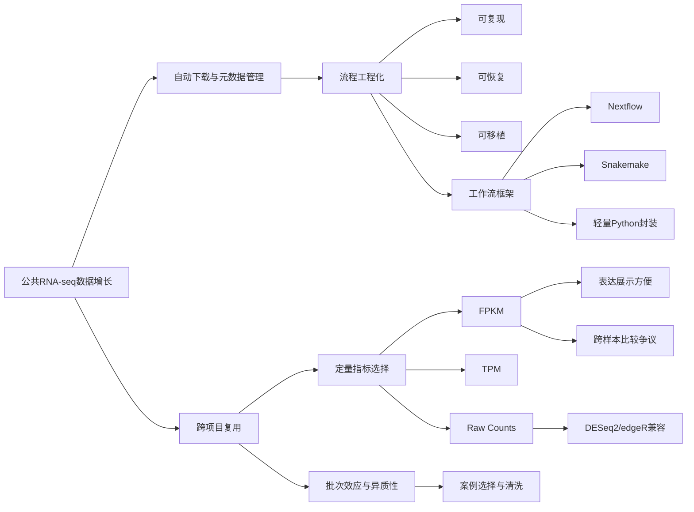
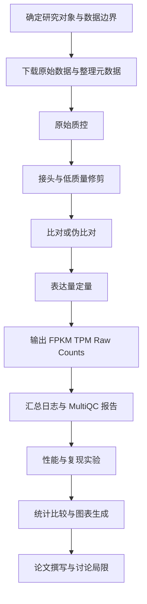
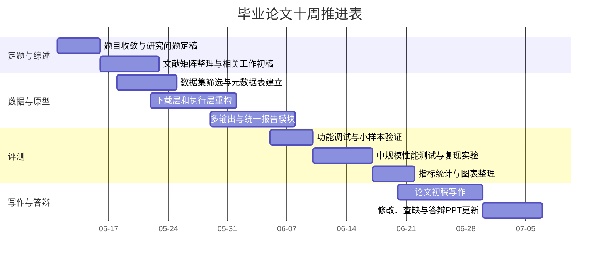

# 基于开题材料的毕业论文综合研究报告草案

## 执行摘要

根据当前上传的开题报告与答辩材料，你的论文主题实际上已经可以从材料中识别出来，核心方向是“基于 Python 的自动化 RNA-seq FPKM 计算流程设计与实现”。现有材料已经给出研究背景、技术路线、模块划分、开发工具、阶段计划和初步实现情况，说明你并不是“完全未指定主题”的状态，而是已经完成了一个以公共转录组数据自动下载、质控、修剪、比对与表达量计算为主线的原型性开题。材料中还显示，你的技术栈包括 Python、Bash、多进程、文件锁和终端界面方案，并已开展服务器端测试与流程整合。fileciteturn0file0 fileciteturn0file1

但从当前学术与工程实践看，如果论文题目仍然只强调“FPKM 自动计算”，会显得略窄，且方法学上有被质疑“指标稍显过时”的风险。RNA-seq 主流实践仍会输出 FPKM/TPM，但跨样本比较和差异表达分析更强调保留 raw counts，并注意 FPKM/TPM 不宜被不加区分地跨项目横向比较；同时，现代工作流论文越来越重视流程的可重复、可恢复、可移植和可审计，而不仅是把多个命令串起来自动运行。citeturn32search7turn3search0turn37search2turn33search2turn11search3turn3search2turn3search3turn8search0turn24search1

基于此，本报告建议把论文主线收敛为一个更稳妥、也更容易在本科阶段形成“可答辩成果”的方向：**面向批量公共 RNA-seq 数据的可复现自动化分析流程设计与实现，以 FPKM 为既有输出，以 TPM 与 raw counts 为增强输出，以日志、质控汇总、失败恢复与多数据源适配为工程创新点**。如果后续你补充导师要求、目标物种、数据范围与实验条件，本草案可以直接沿着现有表格更新为定稿版。citeturn32search7turn11search12turn8search5turn9search2turn25search1turn26search2

## 开题材料提炼与缺失信息

当前上传材料已经足以支撑“开题草案深研版”的制作，但离正式论文级研究设计还差一层：需要把“流程实现”进一步上升为“研究问题—评价指标—比较基线—证据链”四位一体的论文结构。尤其是数据边界、评价方法、创新点边界和伦理边界，目前仍存在明显“未指定”项。fileciteturn0file0 fileciteturn0file1

| 开题材料要点 | 当前状态 | 现有信息 | 缺失信息 | 建议补齐方式 |
|---|---|---|---|---|
| 研究背景 | 已给出 | 已明确 RNA-seq 数据量大、传统流程人工干预多、分析效率受限，且需要自动化整合下载、质控、比对与定量模块。fileciteturn0file1 | 背景尚未充分接入“现代工作流可复现性”“FPKM 方法争议”两条文献线。 | 在绪论中加入工作流工程与表达量规范化两条综述线。citeturn32search7turn8search0turn24search1turn37search2turn33search2 |
| 研究问题 | 部分给出 | 当前更像工程目标，已表达“自动化、降低人工操作、提高效率”。fileciteturn0file0 | 缺少可检验的研究问题，例如“是否显著降低处理时间”“是否提升复现实验一致性”。 | 将工程目标重写为 2–3 个可回答的问题，并配套指标。 |
| 研究目标 | 已给出 | 已包含自动下载、质控、清洗、比对、FPKM 计算、终端界面和批量处理。fileciteturn0file1 | 目标尚未分层为“功能性目标、性能目标、方法学目标”。 | 将目标拆为功能、效率、可复现、下游兼容四类。 |
| 研究方法 | 已给出 | 已使用 Python、Bash、多进程、`filelock`、`Textual` 等。fileciteturn0file0 fileciteturn0file1 | 还未说明为什么不用 Snakemake/Nextflow，以及为什么保留 Python 原生实现。 | 在“相关工作”中加入对比论证，说明轻量化原型与标准工作流引擎的取舍。citeturn10search2turn10search9turn10search0turn8search0turn24search1 |
| 数据来源 | 未指定 | 材料提到从公共数据库获取 RNA-seq 数据。fileciteturn0file1 | 未指定物种、数据集 accession、样本数、是否人源、是否开放获取。 | 至少明确 3 类测试集：小样本公开集、中规模公开集、标准 benchmark。citeturn25search1turn25search0turn12search0turn16search0 |
| 评价指标 | 未指定 | 材料提到测试速度与处理能力。fileciteturn0file0 | 没有明确定义 wall-clock time、峰值内存、mapping rate、genes detected、resume 成功率等。 | 建立“工程指标 + 生物结果指标 + 可复现指标”三层体系。citeturn20search0turn9search2turn16search1turn16search0 |
| 预期贡献 | 部分给出 | 已提到减少人工、提升效率、提供用户友好界面。fileciteturn0file0 | 贡献尚未与已有成熟流程区分。 | 明确“面向中文场景的小型服务器批处理轻量工作流”这一定位。citeturn8search5turn24search1turn26search2 |
| 伦理与合规 | 未指定 | 材料未展开。 | 若用人源原始测序数据，需要考虑受控访问、隐私与人类遗传资源管理。 | 优先开放数据；若做人源原始数据，补写合规说明。citeturn19search0turn18search2turn18search3turn12search15turn26search1 |
| 参考文献 | 偏少 | 当前材料中已有若干方法工具的基础性引用。fileciteturn0file1 | 缺少中文综述矩阵、方法争议文献和工作流文献。 | 用本报告的文献矩阵补足。 |

从“补齐优先级”看，最先要补的是数据边界、评价指标、论文题目与创新点表述，因为这三项直接决定你后面写出来的是“工程报告”还是“研究论文”。第二层才是界面形式、日志美化和附加功能。citeturn16search0turn32search7turn8search0turn24search1turn37search2

## 扩展文献综述

现有文献大体可以分为五条主线：RNA-seq 总体最佳实践、质控与报告、比对与定量算法、表达量归一化与差异分析规范、可复现工作流工程。对你的论文来说，最重要的不是“再发明一种新算法”，而是把这五条线组织成一套有设计逻辑、可评估、可答辩的系统。citeturn32search7turn20search0turn5search1turn5search2turn37search2turn8search0turn24search1

### 核心英文与原始文献

| 分类 | 作者、年份 | 期刊/会议 | 研究问题 | 方法 | 主要结论 | 可引用理由 | 链接 |
|---|---|---|---|---|---|---|---|
| 总体综述 | Conesa 等，2016 | *Genome Biology* | RNA-seq 分析应如何遵循最佳实践 | 综述 | 强调实验设计、QC、比对、定量、差异分析与解释的全流程规范 | 可作为全文方法总框架 | urlPubMed摘要turn0search1 / citeturn0search1 |
| 质控 | Wang 等，2012 | *Bioinformatics* | 如何系统评估 RNA-seq 质量 | 工具方法 | RSeQC 涵盖序列质量、GC 偏差、PCR 偏差、gene body coverage 等指标 | 可为 QC 指标与实验章节提供依据 | urlPubMed摘要turn20search0 / citeturn20search0 |
| 报告集成 | Ewels 等，2016 | *Bioinformatics* | 如何汇总多工具/多样本结果 | 工具方法 | MultiQC 能统一展示多工具输出，便于快速识别全局趋势和偏差 | 适合支撑“统一报告模块”设计 | urlPubMed摘要turn9search2 / citeturn9search2 |
| 比对算法 | Kim 等，2019 | *Nature Biotechnology* | HISAT2 如何实现快速准确的图索引比对 | 方法论文 | HISAT2 兼顾 DNA/RNA 图比对与速度 | 为现有技术路线中的 HISAT2 提供方法论依据 | urlPubMed摘要turn5search1 / citeturn5search1 |
| 组装与定量 | Pertea 等，2015 | *Nature Biotechnology* | 如何更准确地从 RNA-seq reads 重建转录组并估计表达量 | 方法论文 | StringTie 在转录本重建与表达估计上优于多种旧工具 | 为 StringTie 作为定量核心提供依据 | url论文页turn5search2 / citeturn5search2turn5search0 |
| 端到端协议 | Pertea 等，2016 | *Nature Protocols* | HISAT-StringTie-Ballgown 如何组成完整流程 | 实验协议 | 提供从比对、合并、定量到比较分析的标准 protocol | 最贴近你当前开题的经典路线 | urlPubMed摘要turn22search2 / citeturn22search2 |
| 轻量定量 | Patro 等，2017 | *Nature Methods* | 如何进行快速且偏差感知的转录本定量 | 方法论文 | Salmon 速度快，且考虑偏差校正 | 适合作为对照路线或扩展方向 | urlPubMed摘要turn21search0 / citeturn21search0 |
| 轻量定量 | Bray 等，2016 | *Nature Biotechnology* | 如何进行近似最优的快速定量 | 方法论文 | kallisto 极快，且在准确度上具有竞争力 | 支撑“比对式 vs 伪比对式”对照 | urlPubMed摘要turn21search1 / citeturn21search1 |
| 计数矩阵 | Liao 等，2014 | *Bioinformatics* | 如何高效把 reads 指派到 feature 上 | 工具方法 | featureCounts 是高效通用的 read summarization 工具 | 可支撑 raw counts 输出模块或对照实现 | urlPubMed摘要turn21search2 / citeturn21search2 |
| 指标争议 | Wagner 等，2012 | *Theory in Biosciences* | RPKM/FPKM 是否可在样本间稳定比较 | 理论分析 | RPKM 在样本间并不一致 | 对“FPKM-only 题目”形成关键警示 | urlPubMed摘要turn3search0 / citeturn3search0 |
| 指标争议 | Zhao 等，2020 | *RNA* | RPKM/TPM 能否直接跨样本、跨 protocol 比较 | 规范性分析 | RPKM/TPM 并非自动可比，常被误用 | 支撑“保留 raw counts”的论文论点 | urlPubMed摘要turn37search1 / citeturn37search1turn37search2 |
| 指标比较 | Zhao 等，2021 | *Journal of Translational Medicine* | TPM、FPKM、normalized counts 哪种更适合下游分析 | 比较研究 | 不同量化值对下游分析影响不同，需按任务选择 | 支撑多输出而非单输出框架 | url期刊页turn33search1 / citeturn33search1turn33search2 |
| 差异分析 | Love 等，2014 | *Genome Biology* | 如何稳定分析 RNA-seq count data | 统计方法 | DESeq2 基于 count data 估计离散度与 fold change | 解释为什么 downstream 不能只保留 FPKM | urlPubMed摘要turn3search2 / citeturn3search2 |
| 工作流工程 | Di Tommaso 等，2017 | *Nature Biotechnology* | 如何实现可重复计算工作流 | 工作流框架 | Nextflow 支持可重复、可扩展、跨平台执行 | 为“流程工程化”提供理论与实践依据 | urlPubMed摘要turn8search0 / citeturn8search0 |
| 工作流工程 | Mölder 等，2021 | *F1000Research* | Snakemake 如何支持可持续数据分析 | 工作流框架 | 强调可读性、软件环境、可重复与可移植 | 为“Python 友好型工作流化”提供依据 | urlPubMed摘要turn24search1 / citeturn24search1 |

### 中文优先补充文献

| 分类 | 作者、年份 | 期刊 | 研究问题 | 方法 | 主要结论 | 可引用理由 | 链接 |
|---|---|---|---|---|---|---|---|
| 中文综述 | 王凯莉、张礼、刘学军，2017 | *中国生物医学工程学报* | 多平台下基因及异构体表达分析应如何理解 | 综述 | 系统回顾芯片与 RNA-seq 平台下基因/异构体表达分析方法 | 适合中文综述与平台差异讨论 | url文章摘要turn29search0 / citeturn29search0turn29search1turn29search7 |
| 中文综述 | 崔凯、吴伟伟、刁其玉，2019 | *生物技术通报* | 转录组测序技术与应用进展为何 | 综述 | 梳理 RNA-seq 技术平台、分析流程与应用方向，并涉及 FPKM/TPM/RPKM 讨论 | 适合绪论与中文背景搭建 | url文章页turn31view0 / citeturn31view0turn27view1 |
| 中文综述 | 李欣等，2019 | *畜牧兽医学报* | RNA-seq 数据分析与功能基因挖掘流程如何组织 | 综述 | 系统综述 reads 质控、比对、注释、拼接、表达评估与差异分析 | 适合论文“相关工作”中文部分 | url文章页turn27view2 / citeturn27view2 |
| 中文综述 | 刘淏晟、张博文，2023 | *北京师范大学学报自然科学版* | 转录组批次效应如何检测与矫正 | 综述 | 总结批次效应来源、检测方法与矫正建议 | 适合公共数据复用时的风险与局限讨论 | url文章页turn30search1 / citeturn30search1turn30search4 |

从文献结构看，你的论文最适合走“成熟算法 + 标准工具 + 工作流工程 + 本地验证”的路线，而不是追求算法原创。对于本科毕业论文，这种路线更容易在有限时间内形成完整证据链：有需求、有实现、有基准、有比较、有讨论。citeturn32search7turn22search2turn8search0turn24search1turn16search0

## 研究现状、争议与空白

当前研究的主热点已经很清楚：一是标准化与可复现工作流，二是比对式和伪比对式定量路线并存，三是公共数据的规模化复用，四是质量控制与批次效应处理，五是结果汇总与工程可用性。对你的题目而言，真正需要把握的是“工程创新”与“方法规范”的平衡。citeturn8search0turn24search1turn8search5turn25search1turn25search0turn26search2turn30search4turn9search2

- **热点一：流程标准化与可复现性**。Nextflow、Snakemake、nf-core 等把 RNA-seq 流程从“命令集合”提升为可迁移、可恢复、可复用的工作流对象，成为当前上游分析工程化的主流方向。citeturn8search0turn24search1turn8search5turn9search1
- **热点二：定量路线多样化**。HISAT2 + StringTie 是经典的比对—组装—定量路线，而 Salmon、kallisto 等代表了更轻量的 transcript-level 量化方案，二者在速度、资源占用和解释路径上各有取舍。citeturn5search1turn5search2turn21search0turn21search1
- **争议一：FPKM 是否还能单独作为论文中心**。文献并没有否定 FPKM 的存在价值，但明确指出它不宜被孤立地作为跨样本比较和差异表达的唯一基础；许多平台现在都会同时提供 counts、TPM 与 FPKM。citeturn3search0turn37search2turn33search2turn11search12turn11search3
- **不足一：公共数据复用的“最后一公里”仍然痛苦**。SRA/GEO/NGDC 已经提供了海量开放资源，但元数据不一致、批次效应、平台异质性和下载转换开销仍是实际复用中的难点。citeturn25search1turn25search16turn12search0turn26search5turn30search4
- **不足二：现有成熟流程往往偏“重量级”**。像 nf-core/rnaseq 这类流程功能强大，但对初学者、本地服务器、小规模课题组和中文教学场景来说，仍然存在学习成本与部署门槛。这里恰恰给“轻量化、中文场景友好、可直接复现实验”的本科论文留出了空间。citeturn8search5turn24search1turn10search0
- **不足三：可视化、失败恢复、日志审计常被低估**。很多论文更关注算法精度，而对“流程中断能否续跑”“参数与软件版本是否可追踪”“用户是否能快速定位错误”讨论不足，但这些恰恰是工程型毕业论文最容易形成亮点的部分。citeturn9search2turn17search2turn17search11turn10search9

下图把当前研究结构与你的论文切入点对应起来。图示系依据上述综述、方法论文和工作流文献综合归纳。citeturn32search7turn8search0turn24search1turn37search2turn30search4

如果把这些热点和空白放回你的题目中，一个清晰判断是：**最值得做的不是“再实现一次 FPKM”，而是用可复现实验去回答“小型/中型服务器场景下，怎样把公共 RNA-seq 上游分析做成低成本、低门槛、可审计的实用流程”**。citeturn25search1turn12search0turn8search0turn24search1turn9search2

## 可行研究方向与支持性数据

### 备选研究方向与具体研究问题

| 方向 | 研究问题 | 可用理论框架 | 建议方法 | 可用数据源 | 可行性评估 | 资料依据 |
|---|---|---|---|---|---|---|
| ★ 轻量化可复现上游流程 | 在本地服务器/实验室环境下，能否实现从公共数据库下载到 QC、修剪、比对、定量、报告的一键化批处理，并支持断点续跑与日志审计？ | 工作流工程、计算复现性 | 系统设计 + 基准测试 | SRA、GEO、GSA 开放数据 | **高**；最稳妥、最适合本科论文主线 | fileciteturn0file1 citeturn25search1turn25search0turn12search0turn8search0turn24search1turn9search2 |
| ★ FPKM/TPM/raw counts 多输出兼容 | 如何在保留 FPKM 输出的同时，补齐 TPM 与 counts，使流程兼容聚类、可视化和差异分析？ | 表达量归一化与测量理论 | 比较实验 + 输出一致性分析 | GDC、GTEx、recount3、自建流程输出 | **高**；最能提升论文学术表达质量 | citeturn3search0turn37search2turn33search2turn11search3turn11search12turn3search2 |
| HISAT2+StringTie 与 Salmon/kallisto 对照 | 比对式与伪比对式流程在时间、资源、结果一致性上有何差异？ | 算法比较与系统 benchmark | 对照实验 | SEQC/MAQC、SRA 公开集、recount3 | **中高**；论文价值高，但实验量较大 | citeturn5search1turn5search2turn21search0turn21search1turn16search0turn32search1 |
| 下载层优化与缓存策略 | 从 `fastq-dump` 升级到 `prefetch + fasterq-dump`，并结合 SRA Lite，能否显著减少下载与转换瓶颈？ | 数据工程与 I/O 优化 | 工程实验 | SRA 开放数据 | **高**；实现简单、效果通常明显 | citeturn4search0turn4search1turn4search13turn25search10 |
| 人机交互与错误恢复 | Textual/TUI 界面、进度展示和错误提示是否能降低使用门槛并提高可维护性？ | HCI、可观测性 | 原型实现 + 专家启发式评估 | 本地测试任务 | **中**；适合作为辅线创新点 | citeturn10search0turn10search4turn10search20turn9search2 |
| 工作流引擎化与容器迁移 | Python 原型能否进一步迁移为 Snakemake/Nextflow + 容器，以增强可移植性？ | 工作流管理、环境封装 | 重构实现 + 迁移评估 | 同一批 benchmark 数据 | **中**；论文层次高，但周期更长 | citeturn8search0turn24search1turn17search1turn17search2turn17search11 |

如果只能选一个最稳妥的主线，我建议采用**“方向一 + 方向二”捆绑方案**：主论文写可复现自动化流程，实验章节重点比较 FPKM-only 与 FPKM/TPM/counts 多输出方案的工程价值与下游兼容性；方向四和方向五可作为亮点模块嵌入，不必单独拉成第二论文。citeturn37search2turn33search2turn8search0turn24search1turn9search2

### 支持性数据、公开数据库与典型案例

| 数据源/案例 | 类型 | 可获取内容 | 适合用途 | 获取难度 | 官方入口 |
|---|---|---|---|---|---|
| NCBI SRA | 原始测序库 | SRA/FASTQ、元数据 | 原型流程真实跑通、下载/转换测试、批处理中断恢复 | 低 | urlNCBI SRAturn25search1 / citeturn25search1turn25search4 |
| NCBI GEO | 功能基因组仓库 | 处理后矩阵、样本注释；HTS 原始数据会转存到 SRA | 选择案例、获得 processed data 做快速验证 | 低 | urlNCBI GEOturn25search0 / citeturn25search0turn25search16 |
| GSA | 中国原始组学库 | 原始序列数据 | 优先满足中文权威来源与国内案例需要 | 低 | urlGSAturn12search0 / citeturn12search0turn12search4 |
| GSA-Human | 中国人源原始组学库 | 受控的人源原始数据 | 若论文做人源合规案例，可作高级扩展 | 高 | urlGSA-Humanturn12search15 / citeturn12search15turn26search0 |
| OMIX | 中国多组学归档 | 包括转录组等开放/受控数据与人类遗传资源信息 | 适合做中国场景的数据访问策略讨论 | 中 | urlOMIXturn12search5 / citeturn12search5turn26search1 |
| GEN | 统一处理的表达门户 | 多物种 bulk/scRNA-seq 统一处理表达谱 | 快速验证表达结果、构建对照案例 | 低 | urlGene Expression Nebulasturn26search2 / citeturn26search2turn26search5turn26search13 |
| GTEx Portal | 人体正常组织表达资源 | 开放表达数据、QTL、组织层表达 | 做正常组织表达参考与跨组织展示案例 | 低 | urlGTEx Portalturn11search1 / citeturn11search1turn11search10 |
| GDC Data Portal | 癌症数据平台 | BAM、raw counts、TPM、FPKM、FPKM-UQ | 验证多输出兼容性；说明平台实际会保留多种量化值 | 中 | urlGDC Data Portalturn11search6 / citeturn11search6turn11search12turn11search3 |
| recount3 | 统一处理大规模 RNA-seq 资源 | 统一管线处理的海量人/鼠 RNA-seq | 做再分析、结果合理性对照 | 低 | urlrecount3论文turn2search2 / citeturn2search2 |
| SEQC/MAQC-III | 经典 benchmark 案例 | 准确性、重复性、信息量 benchmark 研究 | 用作评测设计的标准参照 | 中 | urlSEQC/MAQC 论文turn16search0 / citeturn16search0 |

需要特别说明的是，这个论文主题属于**生物信息流程工程**，因此“统计年鉴—行业宏观数据”不是主证据链；你真正应优先投入精力的是 RNA-seq 原始数据仓库、统一处理表达门户和方法论文数据库。如果需要补充“中国生物信息基础设施建设”的宏观背景，再把 url国家生物信息中心turn14search2 作为辅助材料即可。citeturn14search2turn12search0turn26search2

## 研究设计建议

综合文献和你现有开题的完成度，最适合落地的研究设计不是单纯“写一个脚本”，而是**系统设计 + 基准评测**。论文应把“自动化 RNA-seq 上游流程”作为研究对象，把“效率、可复现性、结果兼容性、可用性”作为因变量，把“流程架构、下载策略、量化输出策略、执行层设计”作为自变量。citeturn8search0turn24search1turn9search2turn37search2turn33search2

技术路线建议采用“双层结构”：底层保留 Python 模块化封装，继续使用 `multiprocessing.Pool` 做样本级并行，`filelock` 保护关键输出，`Textual` 负责终端交互；上层则引入显式的配置文件、任务依赖描述与统一报告机制。若时间允许，再追加 Snakemake 或 Nextflow 迁移版作为对照组，这样既保住你当前实现基础，也能在论文中清楚说明“轻量原型”与“标准工作流引擎”的差别。citeturn10search2turn10search9turn10search0turn8search0turn24search1

下载层建议从传统 `fastq-dump` 思路升级为 `prefetch + fasterq-dump`，因为 NCBI 文档已明确把 `fasterq-dump` 作为更快的后继工具，并指出 `prefetch + fasterq-dump` 是提取 FASTQ 的高效组合；若磁盘和带宽成为瓶颈，可以进一步考察 SRA Lite 以降低存储与传输负担。citeturn4search0turn4search1turn4search13turn25search10

### 变量与测量建议

| 维度 | 变量 | 测量方式 | 论文意义 |
|---|---|---|---|
| 效率 | 总运行时间、单样本平均时间、吞吐量 | wall-clock time，批量样本完成数/小时 | 证明自动化价值 |
| 资源占用 | 峰值内存、CPU 利用率、磁盘占用 | `time`、系统监控、日志统计 | 证明流程是否适合实验室服务器 |
| 生物结果质量 | mapping rate、unique alignment、genes detected、gene body coverage、污染/偏差提示 | HISAT2/SAMtools/RSeQC/MultiQC 报告 | 证明流程不是“快但不可靠” |
| 稳健性 | 中断恢复成功率、重复运行一致性、缺失文件处理 | 人为中断实验、输出 checksum、一致性比较 | 体现工程成熟度 |
| 下游兼容性 | 是否同时输出 FPKM、TPM、raw counts；是否可直接进入 DE 分析 | 文件清单与下游脚本可接入测试 | 解决 FPKM-only 的论文风险 |
| 易用性 | 手工命令数、配置复杂度、错误可定位性 | 用户步骤计数、专家启发式评估 | 体现用户友好与教学价值 |

这些指标并不是任意凑数，而是直接对应文献中的主流评价逻辑：RSeQC 与 ENCODE 体系强调 QC 指标完整性，SEQC/MAQC 强调重复性与可比性，规范化争议文献强调不能只看 FPKM 数值漂亮与否，MultiQC 则强调多工具结果一体化展示。citeturn20search0turn16search1turn16search0turn37search2turn33search2turn9search2

### 推荐分析流程

下图给出一个适合直接写进论文“研究设计”章节的方法框架。图示依据官方工具文档、标准协议和 benchmark 研究归纳。citeturn4search2turn4search3turn5search1turn5search0turn9search2turn16search0

在样本设计上，建议采用“三层案例”而不是单一数据集：第一层选 1 个小样本公开数据集用于功能调试，第二层选 1 个中等规模公开数据集用于性能测试，第三层引入 1 个 benchmark 或标准化表达资源用于结果合理性对照。这样可以把“能跑通”“跑得快”“结果有依据”三件事分开验证。citeturn25search1turn25search0turn16search0turn2search2turn11search3

在统计分析上，若实验资源有限，不一定非要上复杂模型。更现实的设计是：每组流程重复运行 3 次，比较总耗时、峰值内存、QC 指标、输出矩阵相关性，并用描述统计、t 检验或 Wilcoxon 检验、Spearman/Pearson 相关、必要时的 Bland–Altman 图来呈现差异。对于本科论文，这已经足以构成方法评价章节。citeturn16search0turn33search2turn32search1

伦理与局限性必须单列。若使用开放非人源数据，风险最低；若使用开放的人源 processed data，风险可控；若涉及中国人源原始测序数据或受控数据，则需要遵守《中华人民共和国人类遗传资源管理条例》、个人信息保护相关法律，以及相应平台如 dbGaP、GSA-Human、OMIX 的访问政策。论文中还应诚实说明：你的工作重点是流程工程与复现实验，不是提出新型比对算法或新型统计模型。citeturn19search0turn18search2turn18search3turn12search15turn26search1

## 写作计划与优先检索来源

### 论文章节写作要点

| 章节 | 写作重点 | 建议证据材料 |
|---|---|---|
| 绪论 | 说明 RNA-seq 公共数据规模增长、上游分析流程繁琐、自动化与可复现性的现实需求 | 中文综述 + Conesa 综述 + 开题材料 |
| 相关工作 | 比较 HISAT2/StringTie、Salmon/kallisto、MultiQC、Snakemake/Nextflow；讨论 FPKM 争议 | 文献矩阵与官方文档 |
| 需求分析与系统设计 | 说明输入、输出、模块边界、异常处理、配置方式、日志与报告结构 | 你现有原型设计图 + 推荐架构 |
| 系统实现 | 写模块实现、并行机制、锁机制、UI、执行流程、环境部署 | 代码截图、流程图、运行示意 |
| 实验与评估 | 描写数据来源、评价指标、实验分组、性能和结果对比 | benchmark 数据、QC 报告、统计图 |
| 结论与展望 | 总结系统价值、局限与未来扩展，如容器化、工作流引擎化、多数据源接入 | 实验结果与文献对照 |

### 建议时间表

当前日期为 **2026 年 5 月 10 日**。下面给出一个适合你现阶段的 **10 周**推进表，比传统“12 周平铺”更紧凑，也更适合边开发边写作。该时间表与当前开题阶段匹配。fileciteturn0file0 fileciteturn0file1

### 参考文献与优先检索来源清单

| 类别 | 推荐入口 | 用途 | 优先级 |
|---|---|---|---|
| 中文学术数据库 | urlCNKIturn13search0；url万方数据turn13search1 | 检索中文综述、学位论文、核心期刊、方法应用文章 | 最高 |
| 中文国家生物数据平台 | url国家生物信息中心turn14search2；urlGSAturn12search0；urlGene Expression Nebulasturn26search2；urlOMIXturn12search5 | 获取中国权威数据资源、国内案例、统一处理表达资源 | 最高 |
| 英文原始论文数据库 | urlPubMedhttps://pubmed.ncbi.nlm.nih.gov/；urlPMCturn20search4 | 找方法原文、协议、benchmark、工具论文 | 最高 |
| 英文引文追踪数据库 | urlWeb of Scienceturn13search2；urlScopusturn13search6；urlGoogle Scholarturn15view0 | 做引文追踪、找高被引方法文献与近年综述 | 高 |
| 国际数据门户 | urlNCBI SRAturn25search1；urlNCBI GEOturn25search0；urlGTEx Portalturn11search1；urlGDC Data Portalturn11search6 | 数据集选择、案例验证、输出结果对照 | 高 |
| 重点英文期刊 | *Genome Biology*、*Bioinformatics*、*Nature Biotechnology*、*Nature Methods*、*Nucleic Acids Research*、*Journal of Translational Medicine*、*RNA* | 重点检索方法论文、benchmark 和规范讨论 | 高 |
| 重点中文期刊 | *生物技术通报*、*中国生物医学工程学报*、*北京师范大学学报自然科学版*、*畜牧兽医学报* | 搭建中文综述、国内表达分析与批次效应讨论 | 高 |

补充一点：如果检索到老的 EBI/ArrayExpress 号，不要在旧入口上耗太久，因为 ArrayExpress 界面已经退役，旧数据迁移到了 BioStudies Collection。这个细节在你后面做跨库检索时很容易节省时间。citeturn11search8turn11search14